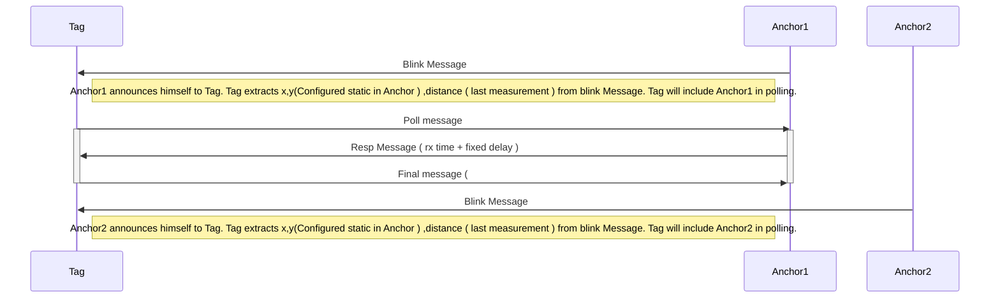

# vertx-esp8266
For a complete view : [with UML sequence diagrams](https://vortex314.github.io/vertx-esp8266)
The purpose is to have a framework for small embedded devices that have the ease of integration and development.

This framework is based on the ideas that also live  in Vertx and Node.js.
## Features :
 1. Loosely coupled and autonomous objects . They have no interface towards each other except a common eventbus, they are not aware of their existence. The wiring of events is done outside. 
 2. Events have a string signature which is send as a hash for fast correlation between publisher and subscriber. Example :"mqtt/connected" is send to help the programmer remember what he send and received, at compile time only a 16bit int is sued.
 3. An eventbus to send message between different objects 
 4. Eventbus addressing is based on addresses formulated as strings, internally these are converted to unique id's ( 16 bit ) which are more performant to do the routing.
 5.  Use of lambda's to specify event handlers , keeps the code of event handling easily centralized in the code.
 6.  Verticles / Objects are eventLoop tasks ( VerticleCoRoutine ) or independent FreeRtos tasks ( VerticleTask ). Attention need to be paid when handlers are async invoked between Freertos tasks. Concurrency can be an issue. So the eventhandler of the task is mostly limited to provide a signal to itself.
 7. Serialization of messages on the Eventbus are based on CBOR binary serialization which proves to be efficient 
 8. .The framework comes with a list of  predefined Objects / Actors :

-- Wifi : to signal connection setup and disconnection
-- Mqtt : assure publishing of events to mqtt server and maintain connection
-- Config : assures store of persistent config items
-- Telnet : CLI interface for chaning config
-- Monitor : reports task state to logger
--  Hardware : abstraction interface for peripherals
-- DWM1000_Anchor
-- DWM1000_Tag

## Hardware
https://docs.google.com/document/d/1fxgZ6O5Crq3wHmV1OV_fEfGh67ktuzFFL1c-V1uz-TM/pub

It uses both led's on a nodemcu esp8266
- led 1 : slow blinking : wifi connected, fast blinking : no connection
- led 2 : slow blinking :  mqtt connected, fast blinking : no connection


## Configuration via telnet
You can open a telnet session towards the esp8266 once it's on the wifi network. the compilation picks up some environment variables to load the first Wifi AP.  The below example as already configured the system.host property to "anchor3", so it's visible via mDNS under "anchor3.local".
The property dwm1000.role is used to determine it's role as anchor or tag. 
```
    $ telnet anchor3.local
    Trying 192.168.0.102...
    Connected to anchor3.local.
    Escape character is '^]'.
    anchor3 $ config show
    {
    "system": {
    "host": "anchor3"
    },
	  "dwm1000": {
	    "x": 1000,
	    "y": 2000,
	    "role": "A"
	  },
	  "telnet": {
	    "port": 23
	  },
	  "wifi": {
	    "ssid": "YourSSID",
	    "pswd": "YourPassword"
	  }
	}
	anchor3 $ config set service option abcdef
	 done - service option=abcdef 
	anchor3 $ config show
	{
	  "system": {
	    "host": "anchor3"
	  },
	  "dwm1000": {
	    "x": 1000,
	    "y": 2000,
	    "role": "A"
	  },
	  "telnet": {
	    "port": 23
	  },
	  "wifi": {
	    "ssid": "YourSSID",
	    "pswd": "YourPassword"
	  },
	  "service": {
	    "option": "abcdef"
	  }
	}
	anchor3 $ config save
	 config saved.
	anchor3 $ <ctrl-D><enter> closes the connection
	Connection closed by foreign host.
```



> Written with [StackEdit](https://stackedit.io/).
